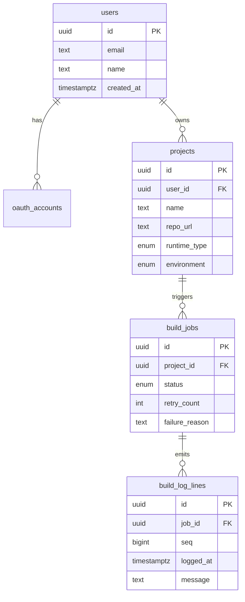
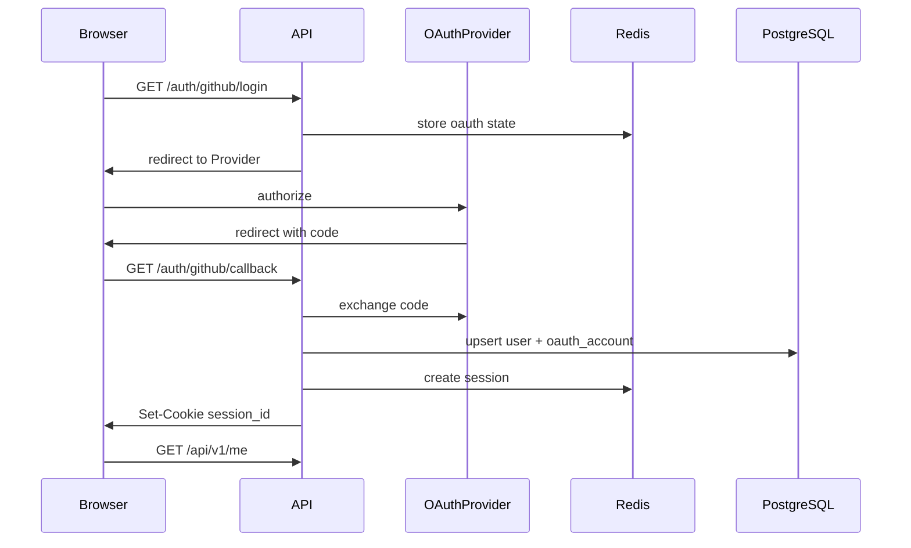

# Architecture Notes

## Overview

Dev Platform is a monorepo with three runtime processes:

1. **Go API** — OAuth, REST API, SSE log streaming
2. **Go Worker** — asynchronous build job processor
3. **Next.js Frontend** — authenticated UI

Shared infrastructure:

- **PostgreSQL** — users, projects, jobs, logs
- **Redis** — session store and OAuth state
- **Nginx** — single-origin reverse proxy for local/staging

## Data Model



All domain tables include audit fields: `created_by`, `created_at`, `updated_at`.

## Authentication Flow



Sessions live in Redis (`session:{id}` → `user_id`, TTL 7 days). Protected routes validate the session cookie and scope all queries by authenticated user ID.

## Worker Design

The worker uses a production-style polling loop:

1. Poll PostgreSQL for the next `queued` job
2. Claim with `SELECT ... FOR UPDATE SKIP LOCKED` inside an `UPDATE ... RETURNING`
3. Process through simulated stages: building → scanning → deploying
4. Append timestamped logs to PostgreSQL (with secret masking)
5. Notify SSE subscribers via `LISTEN/NOTIFY` trigger on log insert
6. Respect cancellation (`cancelled_at`) between stages
7. Limit concurrency with an in-process semaphore (`WORKER_CONCURRENCY`)

### Why SKIP LOCKED?

`FOR UPDATE SKIP LOCKED` allows multiple worker instances to poll safely without blocking each other. Locked rows are skipped so only one worker claims a given job.

### Retries and Failures

Jobs track `retry_count` and `max_retries`. On failure the worker can re-queue the job until retries are exhausted, then mark `failed` with a `failure_reason`.

## Log Streaming

Clients open an SSE connection to `/api/v1/builds/{id}/logs/stream`. The API:

1. Validates ownership
2. Sends existing log lines
3. `LISTEN`s on a PostgreSQL notification channel per job
4. Pushes new lines as SSE events
5. Polls job status until terminal state

## Security

- Secrets loaded from environment variables only
- Repository URLs validated (HTTPS, matching provider host, no embedded credentials)
- Row-level ownership checks on projects and builds
- Sensitive log patterns masked before persistence
- httpOnly session cookies; `Secure` flag enabled in production

## Tradeoffs

| Decision | Rationale |
|----------|-----------|
| Redis sessions | Fast revocation and TTL; avoids session table writes on every request |
| PostgreSQL job queue | Simple ops, transactional claiming; good fit for moderate throughput |
| Simulated build stages | Demonstrates worker design without requiring real CI infrastructure |
| Nginx single origin | Simplifies cookie and OAuth callback handling across UI and API |

## Deployment Topology (Staging)

```text
Internet → TLS LB → Nginx (:80)
                    ├→ frontend:3000
                    └→ api:8080
worker → postgres:5432
api    → redis:6379
```

TLS terminates at the load balancer for `app-dev.vibsl.com`. Nginx disables buffering for SSE routes proxied to the API.
